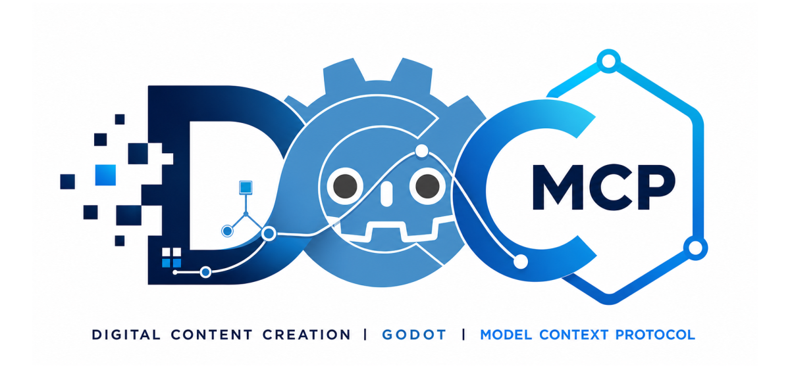

# dcc-mcp-godot

<p align="center">
  
</p>

## Agent workflow

AI agents should use the shared gateway through `dcc-mcp-cli`; IDE users may
continue to use the MCP endpoint. Prefer typed skills and tools over raw scripts.

### Install or update the CLI

`dcc-mcp-cli` is the preferred control path for every shell-capable agent. If
it is missing, ask the user before installing the latest official release:

```bash
# Linux/macOS
curl -fsSL https://raw.githubusercontent.com/dcc-mcp/dcc-mcp-core/main/scripts/install-cli.sh | sh

# Windows PowerShell
powershell -ExecutionPolicy Bypass -c "irm https://raw.githubusercontent.com/dcc-mcp/dcc-mcp-core/main/scripts/install-cli.ps1 | iex"
```

Keep an official build current through the release manifest:

```bash
dcc-mcp-cli update check
dcc-mcp-cli update apply
```

`update apply` downloads and stages the latest CLI for the next launch. It
does not update a running `dcc-mcp-server`; update that server in its own
environment.

```bash
dcc-mcp-cli dcc-types
dcc-mcp-cli list
dcc-mcp-cli search --query "<task>" --dcc-type godot
dcc-mcp-cli describe <tool-slug>
dcc-mcp-cli call <tool-slug> --json '{"key":"value"}'
```

`dcc-types` reports release-catalog support; `list` reports live sessions. If a
tool belongs to an inactive progressive skill, call `dcc-mcp-cli load-skill <skill-name> --dcc-type godot` before retrying. For post-task improvement,
attach a stable session id with `--meta-json`, query `dcc-mcp-cli stats --range 24h --session-id <task-id>`, then pass the bounded evidence to the
`review_skill_improvement` prompt from `dcc-mcp-skills-creator`.


Godot 4 editor adapter for the DCC Model Context Protocol ecosystem. It ships a GDScript
`EditorPlugin`, an `EngineDebugger` runtime peer, 163 on-demand tools, and a tested 2D
arena-roguelike skill.

## Install

The canonical agent-first, three-platform lifecycle is documented in
[`install.md`](install.md). It provides plan-first JSON, staged project updates,
receipts, repair, live verification, upgrade, and receipt-owned uninstall.

```bash
pip install dcc-mcp-godot
dcc-mcp-godot install /path/to/project --dcc-path /path/to/godot --dry-run --json
dcc-mcp-godot install /path/to/project --dcc-path /path/to/godot --yes --json
```

The legacy install-only alias remains compatible:

```bash
dcc-mcp-godot-install /path/to/project
```

When using only that legacy alias, enable **DCC-MCP Godot** under **Project
Settings > Plugins**. Start the adapter with either compatible form:

```bash
dcc-mcp-godot
dcc-mcp-godot serve
```

Each adapter instance uses an OS-assigned MCP port and registers it for CLI discovery.
Connect through the stable gateway at `http://127.0.0.1:9765/mcp`; set
`DCC_MCP_GODOT_PORT` only when a fixed direct endpoint is required. The plugin connects
to the loopback bridge at `ws://127.0.0.1:3847`; override the bridge port with
`DCC_MCP_GODOT_BRIDGE_PORT` before starting both processes.

## Agent workflow

1. Search skills for the required domain, such as `Godot animation`, `Godot runtime`, or
   `Godot TileMap`.
2. Load only the returned domain skill. Tools remain deferred until their skill is loaded.
3. Inspect the project or scene before mutating it, then save and validate the result.
4. Load `godot-runtime`, `godot-input`, or `godot-testing-qa` after starting the game when
   live inspection, input simulation, or QA assertions are required.

The original `godot-project`, `godot-scene`, and `godot-roguelike` skills remain available.

## Capability skills

The adapter groups 164 fine-grained tools into 23 independently loadable domains:

| Domains | Tools |
| --- | ---: |
| Project, scene management, node, script, editor | 47 |
| Input and runtime | 27 |
| Animation and AnimationTree | 14 |
| 3D scene, physics, particles, navigation, audio | 29 |
| TileMap, Theme/UI, shader, resource | 24 |
| Batch/refactor, analysis, testing/QA, profiling, export | 23 |

Runtime tools use the official `EditorDebuggerPlugin` and `EngineDebugger` channel, so input
events and game-node operations run in the game process rather than the editor process. Enabling
the plugin registers the bundled runtime peer as an autoload; disabling it removes the autoload.

Scene edits use Godot's undo manager and file operations are restricted to `res://` with size and
extension checks. `execute_editor_script` only calls a method on an existing `@tool` project
script. The compatibility tool execute_game_script is not an allowlist: it is a broad public-method
call on an existing runtime node. It must not be used for playtest or RL control, and neither broad
tool accepts raw source for immediate evaluation.

For bounded playtest control, use `execute_typed_action`. It accepts only the strict
`input_action` and exact script-digest-bound `set_property` variants declared in the fixed
`res://.dcc-mcp/playtest-actions.v1.json` project manifest. Calls bind the project, session,
process-unique redacted runtime ID, authority, manifest ID, and manifest SHA-256; replacement,
identity drift, reparse points, extra fields, exhausted budgets, and rate limits fail closed.
The host verifies the exact setter effect and script digest on both sides of mutation. Rejected or
cancelled actions do not consume authority; a cancelled or orphaned claimed mutation is rolled
back before its reservation expires.
Read [Typed playtest actions](docs/playtest-actions.md) before enabling this path. This foundation
does not provide episodes, rewards, trajectories, NPC control, an RL trainer, or another recorder.

### Main-thread work budgets

`get_game_scene_tree`, `get_game_node_properties`, and `find_ui_elements` accept opaque `cursor`
values returned as `next_cursor`. Their `max_nodes` or `max_properties` limits are clamped to 128,
and the default page is 64 items. Each read reports its measured `elapsed_ms`, requested/clamped
`budget_ms` (1–50, default 40), and `budget_exceeded`. When the budget is exhausted the response
is an incomplete page; continue with the returned cursor and never infer a complete snapshot. Do
not construct or retain a second host-side job. Legacy calls without a cursor still return the
original top-level fields, plus the first bounded page and continuation metadata.

`get_game_screenshot` reads the viewport and copies its RGB8/RGBA8 bytes on the Godot runtime
thread. The existing adapter execution thread then encodes and atomically replaces the requested
PNG; `include_base64=true` also encodes that PNG there. No Godot `Image` resource crosses threads.

`get_editor_screenshot` and `capture_frames` use the same immutable raw-pixel handoff; PNG encoding
is never performed on the editor or game thread. `capture_frames` may return fewer frames than
requested when its budget is exhausted; resume with `start_index=next_index`.

`execute_editor_script` accepts `budget_ms` from 1 to 50 and reports `elapsed_ms` plus
`budget_exceeded`; this is an observational contract and cannot preempt GDScript. With
`chunked=true`, the existing method must return `{done: bool, next_cursor?: value}`. An incomplete
chunk returns a machine-executable `next_step` that calls the same path and method with the next
cursor. The adapter does not add a script executor, timer, thread, or job registry.

## Real Godot CI

CI resolves the official `godotengine/godot` latest stable GitHub release and downloads the Linux
editor (reusing the existing cache when present). It starts the packaged MCP server and EditorPlugin, sends real JSON-RPC `load_skill`,
paginated `tools/list`, `tools/call`, and `jobs_get_status` requests, creates and edits a scene,
starts the game, verifies the runtime scene tree, then runs the generated gameplay simulation and
requires `ROGUELIKE_SMOKE_OK`.

Run the same smoke locally:

```bash
python tools/download_latest_godot.py --output .godot-bin
python tests/live_godot_smoke.py --godot /path/to/Godot
```

## Development

```bash
python -m pip install -e ".[dev]"
pytest
ruff check src tests tools
ruff format --check src tests tools
python tools/lint_skills.py
python -m build
python -m twine check dist/*
```
